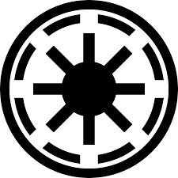
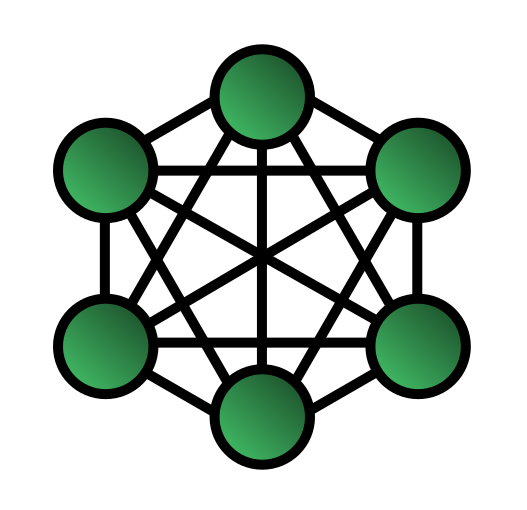

# Guru io connector client 

To connect ujo.guru computers through the mobile barriers.
Based on [Freesi diagnostics](https://bitbucket.org/freesi/diagnostics)

- menu based ui
- command line argutments 

----

## Plan (in finnish)

Kun esteban haluaa että esteban ottaa yhteyden kommonikoidaan seuraavasti

- http://lassila.ujo.guru:XX webuserveri saa parametrin `?ssh=esteban` (php/java style)
- MQTT topic `lassila/estella/ssh-reverse` julkaistaan arvo `esteban`  (metodi löytyy "diagnostic" projektista)
- toimiston puhelinumeroon tulee tekstiviesti "ssh esteban"

Eli toimitaan seuraavasti: 

### Uusi nimi
 - control jotn. - nyt vasta yhteyksien luontiin
 - access, accesser - paska kirjoittaa
 - tunnel, tunneler - ei ihan osu
 - connec, connecter, ugconnector, gio.connector, connector, pinemmille giot.controller, **giocon ja giotcon**
- asiakaspäään apin nimi on **giocon.client**

### [Forkataan diagnostic](https://ujoguru@bitbucket.org/ugdev/giocon.client.git)

 - `git clone https://ujoguru@bitbucket.org/ugdev/giocon.client.git`

### Uusi logo 

Valitettavast kuvat huonosti skaalatti, eli ei ollenkaan. Mikä olisi mieleisin?

#### 1 centro

#### 2 galactic

#### 3 network

#### 4 seitan

#### 5 töppeli

#### 6 torakka

#### 7 tricon

