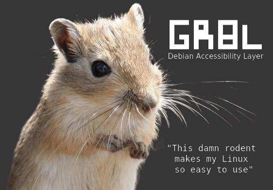

# Gerbil project - Debian Accessibility Layer for degenerates 

*grbl* project aims to simplify and streamline various terminal commands and operations through a modular, user-friendly structure. 



/dəˈdʒɛnəˌreɪdᵻd/ past data stars that having lost the physical, mental, or moral qualities considered normal and desirable; showing evidence of decline.

Below is an overview of the functionalities provided by *grbl*:

## Features

- **Simplified Terminal Commands**: Streamline and rationalize terminal commands using `core.sh`.
- **Modular Structure**: Each module is designed to run independently but can leverage grbl environmental variables for enhanced functionality.
- **User-Level Daemon**: Control timed operations without needing root privileges using `daemon.sh`.
- **File Sharing**: Utilize SSHFS for secure file sharing within a local network with `mount.sh`.
- **Key and Configuration Management**: Store critical personal keys, tokens, and configurations for future projects, both locally and on the server.
- **Backup Solutions**: Take backups of files, configurations, and container services from the server to a local encrypted hard drive using `backup.sh`.

### Network and Communication

- **VPN Simplification**: Simplify VPN account and client usage with `vpn.sh`.
- **Local Message Network**: Use MQTT-based tools for local messaging networks with `mqtt.sh`.
- **SSL Tunnel Management**: Manage SSL tunnels efficiently with `tunnel.sh`.
- **Secure Access**: Implement SSH-based key-only access to the local server with `ssh.sh`.

### Utility Tools

- **Speech Capabilities**: Enable simple speaking capabilities with `say.sh`.
- **Project Management**: Simplify project management, timing, and invoicing with `project.sh`, `timer.sh`, and `counter.sh`.
- **System Management**: Upgrade, install, and remove system tools with `system.sh` and `os.sh`.

### Hardware and Software Integration

- **Corsair Device Tools**: Fun tools for Corsair keyboards and mice based on the `ckb-next` driver with `corsair.sh` and `corsair_raw.sh`.
- **Finance Tools**: Prototype finance tools for budgeting and follow-up with `stonks.sh`.
- **Cloud APIs**: Integrate with various cloud APIs using `fingrid.sh`, `google.sh`, and `stonks/op.sh`.

### Media and Entertainment

- **Media Management**: Place, convert, and tag audio, video, and pictures with `place.sh`, `convert.sh`, and `tag.sh`.
- **Streaming Tools**: Download and stream files from YouTube and Yleisradio with `youtube.sh` and `yle.sh`.
- **Audio Control**: Control and tunnel audio with dedicated tools.
- **Radio Tools**: Listen to web and FM radio with three-key control using `radio.sh`.

### Security, Programming, AI and Productivity

- **Tor Tools**: Utilize Tor-based tools with `tor.sh`.
- **Chip Programmer**: Install a programming environment for Microchip, ST, and AT-Mega chips with `program.sh`.
- **Messaging Tools**: Install and integrate messaging tools like Telegram with `telegram.sh`.
- **AI Integrations**: Integrate simple AI tools with `ai.sh` and `ailib.sh`.
- **Note-Taking and Coding**: Integrate note-taking, coding, and idea cloud tools with editors like Sublime, VSCode, and Obsidian using `note.sh` and configuration files.
- **Template Generation**: Automatically generate templates for new modules and semi-automated test templates.

## Flow chart 

```mermaid

flowchart TD
    Macros("Macros & Templates"):::block
    Install("Installers & Versioning"):::block
    User("User"):::block
    CLI("CLI Interface"):::block
    Core("grbl Core"):::block
    Config("Configuration"):::block
    Modules("Module Framework"):::block
    Daemon("Daemon Service"):::block
    External("External Services"):::block

    %% Command invocation flow
    User -->|"Command"| CLI
    CLI -->|"SendsCommand"| Core
    Core -->|"DispatchesModules"| Modules
    Core -->|"TriggersService"| Daemon

    %% Configuration propagation
    Config -->|"ProvidesConfig"| Core
    Config -->|"ProvidesConfig"| Modules

    %% External integration from modules
    Modules -->|"Calls"| External

        %% Styles
    classDef block fill:#FFFFFF,stroke:#333,stroke-width:2px;

 ```

## Getting Started

Coming soon (or later.. probably never ;)

To get started with **GRBL**, follow these steps:

1. **Clone the Repository**:
   ```sh
   git clone https://github.com/ugcasa/grbl.git
   cd grbl
   ```

2. **Install Dependencies**:
   ```sh
   TBD
   pls. do not install grbl to native os for now.
   ```

3. **Run Modules**:
   ```sh
   TBD
   Some environmental variable starting with GRBL_* need to be full filled to run modules 
   ```

## Contributing

Contributions are welcome! Please open an issue or submit a pull request.

## License

[](https://www.gnu.org/licenses/old-licenses/gpl-2.0.en.html)

