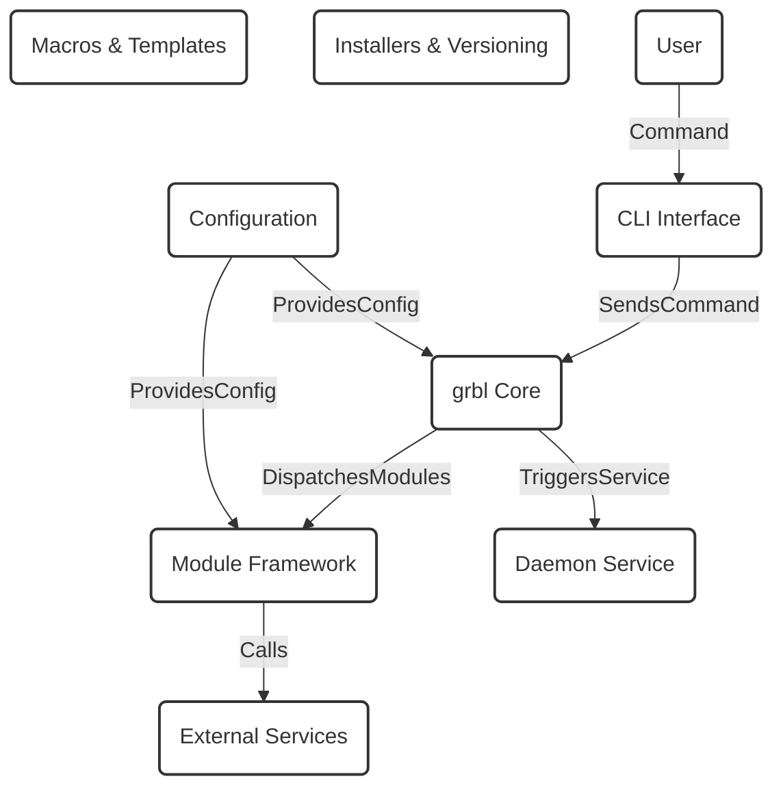

# grbl

**Modular bash-based tool collection for Debian/Ubuntu Linux**

`grbl` unifies and simplifies common command-line workflows through a modular structure: each module operates independently but can leverage shared `GRBL_*` environment variables.

## Features

### Network and Connectivity
- **SSH access**: key-only authentication to the local server (`ssh.sh`)
- **File sharing**: secure file sharing on the local network via SSHFS (`mount.sh`)
- **VPN**: simplified management of VPN accounts and clients (`vpn.sh`)
- **SSL tunnels**: efficient tunnel management (`tunnel.sh`)
- **MQTT**: MQTT-based local messaging network (`mqtt.sh`)

### System Management
- **Command core**: unified command execution through `core.sh`
- **User-level daemon**: scheduled operations without root privileges (`daemon.sh`)
- **Package management**: install, upgrade, and remove system tools (`system.sh`, `os.sh`)
- **Backup**: backup of files, configurations, and container services to an encrypted local drive (`backup.sh`)
- **Keys and configuration**: storage of keys, tokens, and configurations locally and on the server

### Project Workflow
- **Project management**: time tracking and invoicing helpers (`project.sh`, `timer.sh`, `counter.sh`)
- **Notes and editors**: integration with editors such as Sublime, VSCode, and Obsidian (`note.sh`)
- **Scaffolding**: automatic generation of templates for new modules and semi-automated test templates

### Integrations
- **Cloud APIs**: integration with external APIs (e.g. `fingrid.sh`, `google.sh`)
- **Messaging**: Telegram integration (`telegram.sh`)
- **Speech**: simple text-to-speech capability (`say.sh`)
- **Media**: audio, video, and image management, conversion, and tagging (`place.sh`, `convert.sh`, `tag.sh`); web and FM radio (`radio.sh`); streaming (`youtube.sh`, `yle.sh`)
- **Hardware**: control of Corsair keyboards and mice via the `ckb-next` driver (`corsair.sh`)
- **Embedded toolchains**: setup of programming environments for Microchip, ST, and ATmega microcontrollers (`program.sh`)

## Architecture

```mermaid
flowchart TD
    Macros("Macros & Templates"):::block
    Install("Installers & Versioning"):::block
    User("User"):::block
    CLI("CLI Interface"):::block
    Core("grbl Core"):::block
    Config("Configuration"):::block
    Modules("Module Framework"):::block
    Daemon("Daemon Service"):::block
    External("External Services"):::block

    %% Command invocation flow
    User -->|"Command"| CLI
    CLI -->|"SendsCommand"| Core
    Core -->|"DispatchesModules"| Modules
    Core -->|"TriggersService"| Daemon

    %% Configuration propagation
    Config -->|"ProvidesConfig"| Core
    Config -->|"ProvidesConfig"| Modules

    %% External integration from modules
    Modules -->|"Calls"| External

    classDef block fill:#FFFFFF,stroke:#333,stroke-width:2px;
```

## Getting Started

Feel free to clone, but no not install.

## License

[GPL v2](https://www.gnu.org/licenses/old-licenses/gpl-2.0.en.html)
